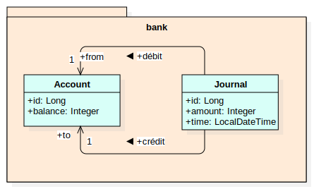

# Mon Projet

## Description
Ce projet illustre un exemple classique de mise en oeuvre d'une transaction avec Spring.

## Diagramme
Le modèle conceptuel de données est illustré en figure 1 :

*Figure 1 : MCD*

Les comptes bancaires (`Account`) indiquent la *balance* du compte (montant en centimes, >=0). Je journal (`Journal`) contient
l'historique des transferts bancaires entre comptes.

Le projet implémente la transaction réalisant un transfert d'argent entre deux comptes bancaires.
